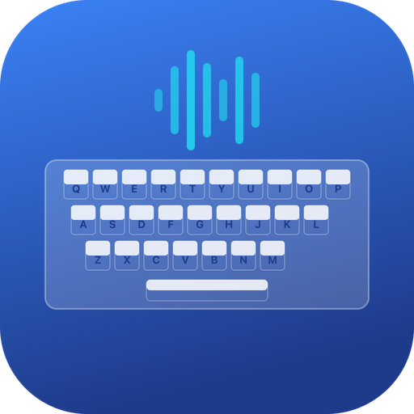

<div align="center">
  
  <h1>键标 KeyM</h1>
  <p>让每一次敲击都有声音，也留下只属于这台 Mac 的节奏。</p>
</div>

> 当前版本：`0.1.0`。支持 Apple Silicon Mac，系统范围为 macOS 26 至 27。KeyM 完全离线运行，不上传键盘与统计数据。

键标 KeyM 是一款常驻 macOS 菜单栏的键盘音效与打字统计工具。它为普通按键播放轻量的内置声音，提供 11 种主题、音量与声音开关，并在本地显示今日按键、累计按键和累计点击数据。修饰键本身保持安静；常用系统快捷键也可以配置为静音组合，但统计仍会正常记录。

## 第一版功能

- 11 种内置音效主题，包括 iPad、机械轴、打字机、静电容、8-bit、木鱼与雨滴等风格。
- 声音开关和音量调节，设置会保存在本机。
- 今日按键、累计按键和累计点击统计。
- 键盘热力图、趋势、应用排行、活动记录与菜单栏 Popup。
- 菜单栏快速开关声音、打开主界面或小弹窗。
- 常用快捷键静音列表；修饰键自身不发声，输入仍会计入统计。
- 单实例运行、权限状态提示、旧数据库与旧设置兼容。

静音时段、静音应用、自定义音效、WPM 展示和成就系统不包含在 `0.1.0` 中。

## 系统要求

- Apple Silicon Mac（M1 或更新）
- macOS 26 或 macOS 27
- 输入监控权限，用于接收全局键盘和鼠标事件

Intel Mac 和更早的 macOS 版本不在当前支持范围内。

## 安装

1. 从 GitHub Releases 下载 `KeyM-0.1.0-macOS-arm64.dmg`。
2. 打开 DMG，将 KeyM 拖入“应用程序”。
3. 因应用未使用 Apple Developer ID 签名和公证，首次启动请右键 KeyM 并选择“打开”；如果仍被阻止，请前往“系统设置 → 隐私与安全性”选择“仍要打开”。
4. 从“应用程序”启动 KeyM。
5. 按界面提示，在“系统设置 → 隐私与安全性 → 输入监控”中启用 KeyM，然后重新启动应用。

如果系统仍保留下载隔离属性，可在终端仅针对 KeyM 执行：

```bash
xattr -dr com.apple.quarantine /Applications/KeyM.app
```

不要关闭系统级 Gatekeeper。KeyM 不上架 App Store，也不使用 Apple Developer ID；请仅从本项目的 GitHub Releases 下载并核对发布页 SHA-256。

## 使用

1. 在“设置”中选择音效主题，调整音量或关闭声音。
2. 正常打字时，KeyM 会播放当前主题的按键音。
3. Command、Shift、Control、Option 等修饰键本身不发声。
4. 在“静音快捷键”中管理不需要声音的组合键；组合键静音不会停止统计。
5. 通过菜单栏图标快速开关声音、打开主界面、打开 Popup 或退出。

所有数据库与设置都保存在本机应用数据目录。KeyM 不要求登录，不包含遥测，也不上传数据。

## 从源码构建

需要安装 Bun、Rust 和 Apple Command Line Tools。当前发布配置只构建 `aarch64-apple-darwin`，最低系统版本为 macOS 26。

```bash
bun install --frozen-lockfile
bun test
bun run build

cd src-tauri
cargo fmt --check
cargo clippy --all-targets --all-features -- -D warnings
cargo test --all-targets --all-features --locked
cd ..

bunx tauri build --bundles app,dmg
```

本项目选择不使用 Apple Developer ID 签名或 Apple 公证。源码构建出的 DMG 会触发 macOS 的“无法验证开发者”提示，这是当前发行方式的预期限制。

## 测试

前端测试使用 Bun/Vitest，后端测试使用 Cargo。测试和运行验证应使用临时数据目录，避免接触真实统计：

```bash
KEYM_TEST_DATA_DIR=/tmp/keym-test bunx tauri dev
```

## 已知限制

- 当前只支持 Apple Silicon 和 macOS 26–27。
- 多显示器与输出设备切换依赖具体硬件环境；第一版重点验证单显示器和内置输出设备。
- 不使用 Developer ID 签名或 Apple 公证，首次启动需要用户手动允许。

## 许可证

本项目使用 [CC0 1.0 Universal](LICENSE)。

---

## English

> Current version: `0.1.0`. KeyM supports Apple Silicon Macs running macOS 26 or 27. It works fully offline and never uploads keyboard or statistics data.

KeyM is a macOS menu bar utility for keyboard sounds and local typing statistics. It plays lightweight built-in sounds for regular keys, offers 11 sound themes, volume and sound controls, and shows today's keystrokes, total keystrokes, and total clicks. Modifier keys stay silent. Common system shortcuts can also be muted while their input is still counted.

## First Release Features

- 11 built-in sound themes, including iPad, mechanical switch, typewriter, electrostatic, 8-bit, wooden fish, and raindrop styles.
- Persistent sound and volume controls.
- Today's keystrokes, total keystrokes, and total clicks.
- Keyboard heatmap, trends, application ranking, recent activity, and a menu bar popup.
- Menu bar actions for sound, the main window, the popup, and quitting.
- Configurable muted shortcuts; modifier keys themselves are silent and statistics remain active.
- Single-instance behavior, visible permission health, and compatibility with existing local data and settings.

Quiet hours, per-application muting, custom sounds, WPM displays, and achievements are not included in `0.1.0`.

## Requirements

- Apple Silicon Mac (M1 or newer)
- macOS 26 or macOS 27
- Input Monitoring permission for global keyboard and mouse events

Intel Macs and earlier macOS releases are outside the current support range.

## Installation

1. Download `KeyM-0.1.0-macOS-arm64.dmg` from GitHub Releases.
2. Open the DMG and drag KeyM into Applications.
3. Because KeyM is not signed or notarized with an Apple Developer ID, Control-click KeyM and choose Open. If macOS still blocks it, use System Settings → Privacy & Security → Open Anyway.
4. Launch KeyM from Applications.
5. Enable KeyM under System Settings → Privacy & Security → Input Monitoring, then restart the app.

If the download quarantine attribute still prevents launch, run this command for KeyM only:

```bash
xattr -dr com.apple.quarantine /Applications/KeyM.app
```

Do not disable Gatekeeper system-wide. KeyM is distributed outside the App Store without a Developer ID. Download it only from this project's GitHub Releases and verify the published SHA-256.

## Usage

1. Choose a sound theme and adjust volume in Settings.
2. Type normally to hear the active theme.
3. Command, Shift, Control, Option, and other modifier keys do not make sounds by themselves.
4. Manage silent combinations in Muted Shortcuts; muted shortcuts are still counted.
5. Use the menu bar icon to toggle sound, open either window, or quit.

All databases and preferences remain on the local Mac. KeyM has no account system, telemetry, or uploads.

## Build from Source

Install Bun, Rust, and Apple Command Line Tools. The release configuration targets only `aarch64-apple-darwin` with macOS 26 as the deployment minimum.

```bash
bun install --frozen-lockfile
bun test
bun run build

cd src-tauri
cargo fmt --check
cargo clippy --all-targets --all-features -- -D warnings
cargo test --all-targets --all-features --locked
cd ..

bunx tauri build --bundles app,dmg
```

This project intentionally distributes without Apple Developer ID signing or notarization. DMGs built from source will trigger macOS's unidentified developer warning.

## Testing

Frontend tests use Bun/Vitest and backend tests use Cargo. Runtime checks should use a temporary data root:

```bash
KEYM_TEST_DATA_DIR=/tmp/keym-test bunx tauri dev
```

## Known Limitations

- Apple Silicon and macOS 26–27 only.
- Multi-display and audio output switching depend on available hardware; the first release primarily validates a single display and built-in output.
- No Developer ID signing or Apple notarization; first launch requires explicit user approval.

## License

This project is released under [CC0 1.0 Universal](LICENSE).
